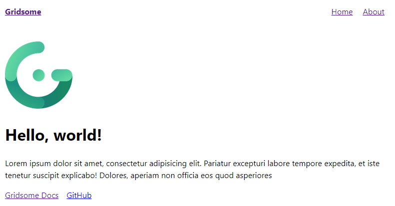

# Introduction

-   Click [here](#topic-will-cover-in-this-tutorial) to skip to the tutorial.

As mentioned in the earlier post, this blog is developed using **Gridsome** frameworks. Here are the brief description of **Gridsome** frameworks.

> **Gridsome** is a **JAMStack** framework for Vue.js for building static generated websites & apps that are fast. **Gridsome** is the **Gatsby** (for React.js) alternative for Vue.js. It is data-driven, using GraphQL to get data from different sources in order to dynamically generate pages from it.

## Why Gridsome?

-   **Vue.js** as frontend
-   Able to use APIs or [Markdown](https://www.markdownguide.org/) for data.
-   **Hot-reloading** feature in development - See code-changes in real time.
-   File-based page routing - Easy routing setup.
-   Static site generation - Can be deploy to any static web host.
-   Provide a **GraphQL playground** to simulate the GraphQL queries result.

## Topic will cover in this tutorial

-   [Installation of Gridsome CLI tool.](#install-gridsome-cli-tool)
-   [Create a new Gridsome project.](#create-gridsome-project)
-   [Folder Structure](#folder-structure)
-   [Plugin](#plugin)
-   [Configuration](#configuration)
-   [Create the Page Layout](#creating-the-page-layout)
-   [Create blog posts](#create-blog-posts)

## Prerequisites

-   Basic HTML, CSS and Javascript
-   Vue.js frameworks
-   Npm / Yarn (Please download & install NodeJs [here](https://nodejs.org/en/download/))
-   GraphQL

## Getting started

> I am using Windows OS, npm and Google Chrome as my browser in this tutorial. Different OS might have different terminal commands.

### Install Gridsome CLI tool

-   Using yarn

```bash
$ yarn global add @gridsome/cli
```

-   Using npm

```bash
$ npm install @gridsome/cli --global
```

### Create Gridsome project

1. Open your terminal / command prompt.
2. `$ gridsome create my-project` to create a new project. _my-project_ can be replaced with your project name.
3. Wait for the installation complete.
4. `$ cd my-project` to change to you project directory.
5. To start the program, use the command `$ npm run develop` or `$ gridsome develop`.

After running the command, open you browser with the url `http://localhost:8080`. You will see a default page generated by **Gridsome** as below.



### Folder Structure

Look into your `my-project` directory, you can see the folder structure as below:

```bash
.
├── package.json
├── gridsome.config.js
├── gridsome.server.js
├── static/
└── src/
    ├── main.js
    ├── layouts/
    │   └── Default.vue
    ├── pages/
    │   ├── Index.vue
    │   └── Blog.vue
    └── templates/
        └── BlogPost.vue
```

#### Root directory

-   **package.json** - This is where all the dependencies for the project will be store.
-   **gridsome.config.js** - This file contains configuration and options for installed plugins.
-   **gridsome.server.js** - This file is used to hook into various parts of the Gridsome server.

#### `/src` directory

-   **main.js** - Import global styles and scripts here. This file is the place to install Vue plugins, register components and directives, etc.
-   **`layouts/` directory** - Layout components are used to wrap pages and templates. The layout components should be indicated as the global component. It also requires a `<slot>` component which inserts the content of pages and template components into the layout.
-   **`pages/` directory** - All components in this directory become the pages for your website. Each page will get its path on the location of its `.vue` file. `src/pages/Index.vue` will become the homepage for your website, while `src/pages/About.vue` will be `your-domain.com/about-us`.
-   **`templates/` directory** - Templates are used for single post views to GraphQL collections. The name of the component file must match the node type in your GraphQL schema.
-   **`components/` directory** - Components that you want to use in several pages or templates can be stored in the `src/components` directory.

#### `/static` directory

-   Files in this directory will be copied directly to dist during build.

## Start building our blog

Here we will start having fun with the coding part. We will get started by describing what we are trying to achieve with the blog. We will have a home page list all the blog posts and have each post with content in Markdown.

> There are no CSS styling in this tutorial. You may add your own CSS styling for your blog site.

### Plugin

> A list of **Gridsome Plugins** can be found [here](https://gridsome.org/plugins/)

In order to allow Gridsome to load and read the Markdown file, we will need to use some gridsome plugins which are `@gridsome/source-filesystem` and `@gridsome/transformer-remark`. `@gridsome/source-filesystem` plugin help to fetched your Markdown files with GraphQL into your components and `@gridsome/transformer-remark` plugin transform your Markdown files into HTML elements. To install these package, run this command:

-   Using yarn

```bash
$ yarn add @gridsome/source-filesystem @gridsome/transformer-remark
```

-   Using npm

```bash
$ npm install @gridsome/source-filesystem @gridsome/transformer-remark --save
```

### Configuration

After install the plugins, then we need to do some configuration. In the `gridsome.config.js` file:

```js
module.exports = {
	siteName: "My Project",
	plugins: [
		{
			use: "@gridsome/source-filesystem",
			options: {
				typeName: "Post",
				path: "./post/**/*.md",
			},
		},
	],
	templates: {
		Post: "/post/:title",
	},
};
```

The configuration above is what we need to setup for the `@gridsome/source-filesystem` plugin. Here are the options set:

-   **typeName** - The GraphQL type and template name. A `.vue` file in `src/templates` must match the `typeName` to have a template for it.
-   **path** - The location of the Markdown content.
-   **templates** - This is the route every post will follow. For example `your-domain.com/post/my-first-post`.

### Creating the Page Layout

#### Layout

In **Gridsome**, `Layout` is the wrapper for pages and templates. Usually `Layout` components are registered as global element so that we can use it in any pages without import the components. In your `main.js` file, you can see the default code as below:

```js
import DefaultLayout from "~/layouts/Default.vue";

export default function(Vue, { router, head, isClient }) {
	// Set default layout as a global component
	Vue.component("Layout", DefaultLayout);
}
```

By default, **Gridsome** import the `Default.vue` component in `/layouts` directory and set as global component as `Layout` so that we can use the `<Layout>` component anywhere in our Gridsome project without importing it to everypage. Now let's look into the default layout component at `/layouts/Default.vue`:

**`src/layouts/Default.vue`**

```html
<template>
	<div class="layout">
		<header class="header">
			<strong>
				<g-link to="/">{{ $static.metadata.siteName }}</g-link>
			</strong>
			<nav class="nav">
				<g-link class="nav__link" to="/">Home</g-link>
				<g-link class="nav__link" to="/about/">About</g-link>
			</nav>
		</header>
		<slot />
	</div>
</template>

<static-query>
	query {
		metadata {
			siteName
		}
	}
</static-query>
```

##### <template\>

This is where the HTML element for the component in Vue.js.

-   `<div>` - The layout component are wrapped into a single `<div>` element.
-   `<header>` - The layout has 1 header with the navigation link to `home` page and `about` page.
-   `<g-link>` - This is the router tag in Gridsome. The `to` attribute defines the url target (similar to `href` attribute in `<a>` tag).
-   `<slot />` - Each layout requires a `<slot>` component. This is where the content coming from pages and templates will be inserted. Layouts can have multiple slots
-   `$static.metadata.siteName` - This is the data fetched from GraphQL. `$static` means data fetched from the `<static-query>` whereas `$page` is the data fetched from `<page-query>`. In this case it will return the `siteName` we defined earlier in our `gridsome.config.js` file.

##### <static-query\>

This is where the GraphQL query defined here. There are two type of queries in Gridsome which are the `<page-query>` and `<static-query>`.

-   `<static-query>` - Use in **Components**.
-   `<page-query>` - Use in **Pages** or **Templates**.

In this case, we request the `siteName` from the `metadata` we declared in our `gridsome.config.js` file.

> Please click [here](https://gridsome.org/docs/querying-data/) for more info about GraphQL query in Gridsome

#### Homepage

The homepage is located at `/pages/Index.vue`. Let's try to remove all the codes in this file and add the below codes to see the difference.

**`src/pages/Index.vue`**

```html
<template>
	<Layout>
		<h1>Welcome to {{ $static.metadata.siteName }}!</h1>
	</Layout>
</template>

<static-query>
	query {
		metadata {
			siteName
		}
	}
</static-query>
```

Now, in your terminal, press `Ctrl + C` to stop the program and run the command `$ npm run develop` or `$ gridsome develop` again. See your page result at `localhost:8080`.


-   `<Layout>` - This is the layout component that described in the previous section. You can see the navigation link at the top of your homepage.

### Create blog posts

Do you still remember the settings in our `gridsome.config.js` file?

**`gridsome.config.js`**

```js{8}
module.exports = {
	siteName: "My Project",
	plugins: [
		{
			use: "@gridsome/source-filesystem",
			options: {
				typeName: "Post",
				path: "./post/**/*.md",
			},
		},
	],
	templates: {
		Post: "/post/:title",
	},
};
```

This line define the path that our blog posts located. Create a `/post` folder in the root directory. So now your folder structure become:

```bash{5}
.
├── package.json
├── gridsome.config.js
├── gridsome.server.js
├── post/
├── static/
└── src/
    ├── main.js
    ├── layouts/
    │   └── Default.vue
    ├── pages/
    │   ├── Index.vue
    │   └── Blog.vue
    └── templates/
        └── BlogPost.vue
```

Now create your own blog posts in `.md` **Markdown** file into the `/post` folder. Here I had created 2 posts:

`post/welcome.md`

```text
---
title: "Welcome"
date: 2020-07-10
---

# Welcome

Welcome to my blog!
```

`post/first-post.md`

```text
---
title: "This is my first post"
date: 2020-07-14
---

# This is header

## This is second header

This is my first paragraph!

> This is a blockquote.

This is a `code` tag.

You can also write **bold** or _italic_ in Markdown.

This is [Markdown](https://www.markdownguide.org/) hyperlink.

1. Ordered list 1
2. Ordered list 2

-   Unordered list 1
-   Unordered list 2
```

Now head back to the `Index.vue` in the `/pages` directory. We want to show the blog posts listing in our home page. Add the below codes to your `Index.vue` file:

**`src/pages/Index.vue`**

```html{4-20,24-40,50-63}
<template>
	<Layout>
		<h1>Welcome to {{ $static.metadata.siteName }}!</h1>
		<hr />
		<u>
			<h2>Posts</h2>
		</u>
		<g-link
			v-for="post in $page.posts.edges"
			:key="post.id"
			class="post"
			:to="post.node.path"
		>
			<div class="post">
				<h3>
					<b>{{ post.node.title }}</b>
				</h3>
				<p>Date: {{ post.node.date }}</p>
			</div>
		</g-link>
	</Layout>
</template>

<style scoped>
	a.post {
		color: black;
		text-decoration: none;
	}

	div.post {
		box-shadow: 0 4px 8px 0 rgba(0, 0, 0, 0.2);
		transition: 0.3s;
		padding: 2px 16px;
		margin: 24px;
	}

	div.post:hover {
		box-shadow: 0 8px 16px 0 rgba(0, 0, 0, 0.2);
	}
</style>

<static-query>
	query {
		metadata {
			siteName
		}
	}
</static-query>

<page-query>
	query {
		posts: allPost {
			edges {
				node {
					id 
					title 
					path 
					date(format: "MMMM D, YYYY")
				} 
			} 
		} 
	}
</page-query>
```

#### <page-query\>

This is where the magic happen in Gridsome. We fetch our post content with GraphQL queries here. Here we query all the blog posts information and assign it to the `posts` object so that we can use the `$page.posts` in our `<template>`.

> You can try the GraphQL query and simulate the result at [`localhost:8080/___explore`](localhost:8080/___explore).

#### <template\>

-   `<g-link>` - Add a router link to our blog post.
    -   `v-for` - Loop through the every post fetched from GraphQL result and create a "card".
    -   `:to` - Set the path to our blog post content.
-   `<style>` - Add some css styling here.

Now, run the command `$ npm run develop` and view your home page again.


Tada~~ We had created all the posts card link to our post content. Now try to click on the card and view our post.


Oops... We hit this error message. This is because we had not create the template for our post yet. Now head to your `/templates` folder and create a file `Post.vue`. We add the below codes into this file:

> **Notes**: The `.vue` filename must be same with the `typeName` we defined earlier in the `gridsome.config.js` file.

**`src/templates/Post.vue`**

```html
<template>
	<Layout>
		<header class="title">
			<h1>{{ $page.post.title }}</h1>
			<p>Published on: {{ $page.post.date }}</p>
		</header>
		<main class="content" v-html="$page.post.content"></main>
	</Layout>
</template>

<page-query>
	query Post($path: String!) {
		post: post(path: $path) {
			id 
			title 
			path 
			date (format: "MMMM D, YYYY h:mma") 
			content
		}
	}
</page-query>

<style scoped>
	.title {
		text-align: center;
	}
</style>
```

The codes are self-explained. We fetched the post info and content through GraphQL in the `<page-query>`, then we pass the content to the `<main>` tag with `v-html` attributes. Now head to your homepage and try to click on the card:


## Conclusion

In this article we had learned how to build our own personal blog by using Gridsome. To learn more you may visit to [Gridsome Documentation](https://gridsome.org/docs/) page.

## Credits

> Basically I'm just the transporter of the **Gridsome** documentation. The full documentation can be found [here](https://gridsome.org/).
